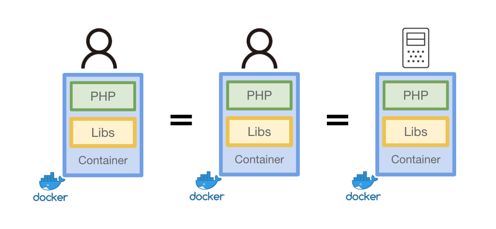

## Dockerとは？
もはやバズワードではなくデファクトスタンダードの立ち位置を確立しはじめたDockerです。  

初学者向けの入門資料として、Dockerを何故使うのか、VMとの違い、どんな技術でできているのか、そしてDockerのプラクティスについて紹介します。

## なぜDockerを使うのか

### 1. ポータビリティ

Dockerはパッケージングのための技術と言っても過言ではないでしょう。  
特定の環境をパッケージングし、どの環境でも動くポータビリティ(可搬性)を保証します。

Dockerは任意のタイミングの状態（ランタイム・ライブラリ・コードのバージョン）を1つのスナップショットとして保存します。  
スナップショットは任意のタイミングの状態を再現することが可能で、そしてそのスナップショットを他の開発者やステージングや本番環境へ高い移植性と可搬性を提供します。

### 2. オーバヘッド

従来のVM型の仮想化の場合、物理レイヤーの仮想化から行いますが、DockerはLinuxカーネルの機能を用いて1プロセスとして隔離された環境を実現します。  
そのため仮想化レイヤーが少なく、VMと比較して軽量で少ないオーバーヘッドで環境を実現することができます。

VMとDockerの違いは次の [VMとDocker](../vm-docker) の章で説明します

### 3. Immutable Infrastructure

DockerはImmutable Infrastructureとしてインフラを不変なものとして扱います。  

今までのインフラはライブラリのアップデートや新しいコードの追加をする際はサーバー内へ"変更"を加えて実現する、 **Mutable Infrastructure** と呼ばれるアプローチでサーバーの更新を行なってきました。  
そのインフラを変更するアプローチとは逆に、サーバー内への変更を行わないアプローチが **Immutable Infrastructure** です。  

このアプローチにより、任意の時点の確実に動作するスナップショットを手に入れることができます。  
変更や追加などの変更が発生する場合は新しく構築してスナップショットを保存し、そのスナップショットを元にサーバーを新しく立ち上げます。  

Dockerには標準でImmutable Infrastructureのアプローチを実現するために **"Dockerfile"** と **"Image"** という機能が標準で備わっています。  

Dockerfileは **Infrastructure as Code(IaC)** としての機能です。  
Infrastructure as Codeはインフラの構成をコードで管理し、宣言的に環境を構築する手法です。  
そして、Dockerfileから生成されたるDocker Imageは先述した特定の時点のスナップショットになりなます。  

Dockerは自然にこのImmutable Infrastructureに取り組むことができ、確実に動くスナップショットを作成することに取り組むことができます。  
また、このスナップショットであるImageにはバージョン情報がデフォルトで付くため、容易に過去のImageのバージョンを指定することでロールバックが可能になりインフラの可用性に繋がります。

!!! Dockerが流行った理由
    コンテナ自体は古くからある概念で、古くからchroot・Jail・LXCのようなプロジェクトが存在します。  
    なぜDockerを流行った理由の1つとして筆者は **配布の容易性** というのが背景としてあると考えています。  
    Dockerはコンテナとしての技術だけではなく、そのコンテナのスナップショットを取得して配布を標準の機能として提供しています。  
    この仕組みを用いることでローカルから本番環境まで用意に同一の環境を使用することができるようになりました。
