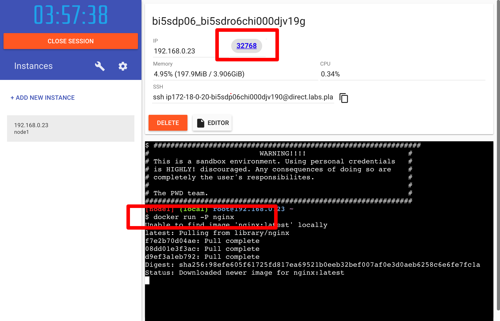

まずはDockerを試してみましょう！  
この章ではDockerコマンドを使用してnginxを実際に立ち上げることを目標とします。

## 1. Play With Dockerへログイン
当資料ではDockerの環境として[Play with Docker](https://labs.play-with-docker.com/) を使用します。  
ローカル環境 (Mac/Windows/Linux) でDocker DesktopなどDockerで動かすことが可能ですがmacOS/Windows/LinuxでそれぞれのOSでの実装が異なってしまうため、ハンズオンではDocker社が提供するDockerのプレイグラウンドである **Play with Docker** を使用してハンズオン環境を統一します。


Play With DockerではDockerHubのアカウントが必要になるため、まだアカウントを作成していない方は作成をしてください。

[https://hub.docker.com](https://hub.docker.com)

## 2. インスタンスの起動
ログインすると以下のような画面が表示されるので、まずはインスタンスを起動します。  
サイドバーの `+ ADD NEW INSTANCE` を押して起動を行ってください。


## 3. nginxの起動
まずは単純にnginxを起動してみます。  
以下のコマンドを起動ターミナルで実行してみます。

```
$ docker run -P nginx
```

後の章でdockerコマンドについて解説をしますが簡単にこのコマンドの説明すると、  
「nginxを起動( `docker run nginx` )し、設定されているポートを公開( `-P` )。」という意味になります。

Play With Dockerではポートを開放するとWebブラウザでアクセスできるようになります。  
以下の画像のようにIPの横にポート番号(画像では `32768` )が表示されていれば起動成功です！




## 4. 起動したnginxへアクセス
試しに起動したnginxサーバーへアクセスしてみましょう。  
表示されたポート番号をクリックすると以下のようにnginxの画面が表示されます。  


## 5. Dockerの停止
Play With Dockerの画面に戻って `Ctrl + c` で起動したnginxを終了させましょう。

## まとめ
`docker run -P nginx` だけでnginxが簡単に起動することができました。  
dockerの手軽さの第一歩を感じてもらえたら幸いです！