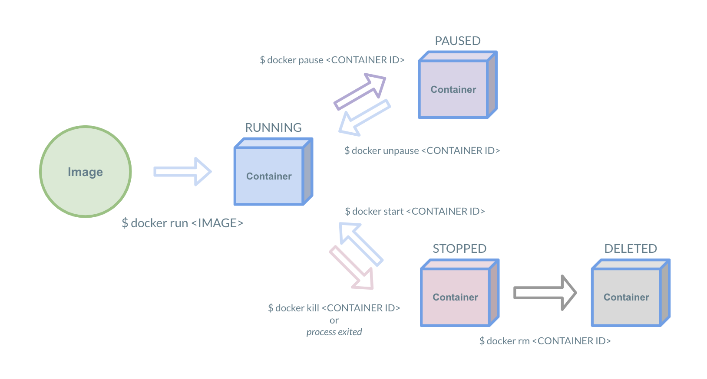

## Docker Containerとは

Docker Image がスナップショットだとしたらDocker Container はその **「スナップショットから起動したプロセス」** です。  

より具体的にいうと `docker run` を実行するとDocker Image をもとにしてDocker Containerが作成され、隔離された環境が作成されます。  
Docker Container は Docker Imageを元にして作成され、リソースの許す限り立ち上げることができます。

意識する点として、Docker Container は1つのコマンドをフォアグラウンドで動かすように設計されていることです。  
Docker Containerは1つのコマンドを隔離された環境で実行し、そのコマンドの実行がフォアグラウンドで終了するまで生存します。

## ライフサイクル


Docker Container は大きく5つの状態を遷移します。  

1. `Image`
    - 指定したDocker Image からDocker Containerを起動します。
2. `RUNNING`
    - Docker Containerが起動した状態です。
    - Dockerfileの `CMD` もしくは `ENTRYPOINT` で指定したコマンドがフォアグラウンドで動いている間がRUNNINGの状態です。
    - 例えば `docker run -P nginx` のようにnginxを起動した場合、nginxが起動してアクセスを待ち受けてる間はRUNNINGの状態となります
3. `STOPPED`
    - 起動したContainerが終了した状態です。
    - 正常終了・異常終了、どのような形であっても終了したContainerはSTOPPEDへ遷移します。
4. `PAUSED`
    - Containerが停止した状態です。
    - ユーザーが `docker pause <CONTAINER ID>` を実行すると、現在の状態を保持して一時停止します。
    - `docker unpause <CONTAINER ID>` で一時停止したコンテナIDを指定することで再開することが可能です。
    - ユーザーが明示的に指定しない限りこの状態へは遷移しません。
5. `DELETED`
    - Docker Container は明示的に削除を行わない限り停止した状態で残り続けます。
    - `docker rm <CONTAINER ID>` で明示的に削除するとDELETEDの状態へ遷移し、削除されます。

## プロセスの隔離


コンテナ内のプロセスはホストマシンや他のコンテナと隔離されて実行されます。  
上記の図のようにホストマシンのDockerで作成されたコンテナは新しい環境を作成し、 `CMD` (もしくは `ENTRYPOINT` )で定義されたプロセスは `PID 1` になります。

ためしに `ps` コマンドを実行するDockerを起動し、その環境の最初のプロセスとして起動していることを確認します。
```console
$ docker run ubuntu ps
  PID TTY          TIME CMD
      1 ?        00:00:00 ps
```

ホストからコンテナがどう見えるかも確認してみましょう。  
準備としてプロセスの関係を見やすくするために `pstree` コマンドをインストールします。
```console
$ apk add --no-cache pstree
```

nginxのDockerコンテナをデーモンとして起動して、 `pstree` で確認してみましょう。
```console
$ docker run -d nginx
Unable to find image 'nginx:latest' locally
latest: Pulling from library/nginx
27833a3ba0a5: Pull complete
e83729dd399a: Pull complete
ebc6a67df66d: Pull complete
Digest: sha256:c8a861b8a1eeef6d48955a6c6d5dff8e2580f13ff4d0f549e082e7c82a8617a2
Status: Downloaded newer image for nginx:latest
eef4217efa74c65b36b7c80012eeaf0a9a8928717f5602a641dc20ddc91daf10
$ pstree
-+= 00001 root /bin/sh -c cat /etc/hosts >/etc/hosts.bak &&     sed 's/^::1.*//' /etc/hosts.bak > /
 |--- 00033 root /usr/sbin/sshd -o PermitRootLogin=yes -o PrintMotd=no
 |-|- 00009 root script -q -c /bin/bash -l /dev/null
 | \-+= 00010 root /bin/bash -l
 |   \--= 02850 root pstree
 \-|- 00008 root dockerd
   \-+= 00038 root containerd --config /var/run/docker/containerd/containerd.toml --log-level debug
     \-+= 02629 root containerd-shim -namespace moby -workdir /var/lib/docker/containerd/daemon/io.
       \-+= 02647 root nginx: master process nginx -g daemon off;
         \--- 02686 #101 nginx: worker process
```

### おまけ
- `$ docker run ubuntu echo hoge` のような一瞬だけ起動するコマンドだとどのように見えるでしょうか
- `$ docker run -d nginx` を複数起動するとどのように見えるでしょうか

## まとめ
- コンテナは隔離された環境で実行される
- Dockerコンテナは1つのコマンドを実行してプロセスを実行する
    - 基本的に「1コンテナ1プロセス」
- ライフサイクルは実行されたコマンドがフォアグラウンド上で実行されている期間
    - バックグラウンドでプロセスが立ち上げられていてもフォアグラウンドでコマンドが終了したらコンテナは停止する

