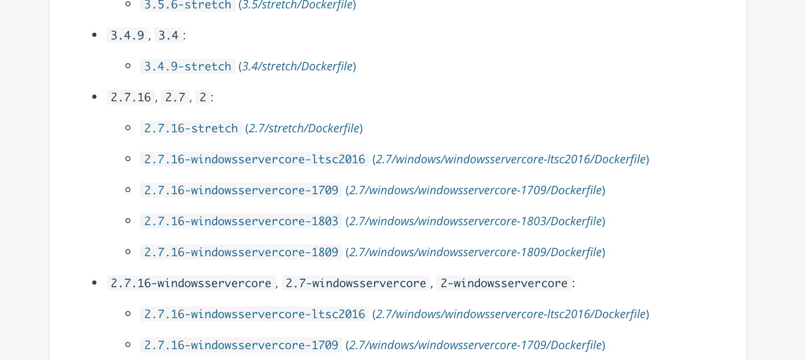

## Docker Imageとは


Imageは**"環境のスナップショット"** としての役割を持っています。  
例えばCentOSやUbuntuのようなOSからNginxやMySQLのようなソフトウェア、PHPやRubyのようなランタイムなどの環境を提供してくれます。

この章ではハンズオン形式でDocker Imageについて学んでいきます。

## Ubuntuを動かす
はじめに、Docker上でUbuntuを動かしてみましょう。  
先程はNginxのようなソフトウェアを動かしましたが、DockerではUbuntuのようなOSも立ち上げることも可能です。

### ImageのPull


Docker Image はDockerの公式が **DockerHub** と呼ばれるサービス上で様々なOS・ソフトウェアを公開しています。  
DockerHub上で公開されているUbuntuを今回は使用します。

まずはUbuntuのDocker ImageをDockerHub上から取得します。  
`docker pull ubuntu` でDockerHub上からローカルへ取得しましょう。

```
$ docker pull ubuntu
Using default tag: latest
latest: Pulling from library/ubuntu
898c46f3b1a1: Pull complete
63366dfa0a50: Pull complete
041d4cd74a92: Pull complete
6e1bee0f8701: Pull complete
Digest: sha256:017eef0b616011647b269b5c65826e2e2ebddbe5d1f8c1e56b3599fb14fabec8
Status: Downloaded newer image for ubuntu:latest
```

### Ubuntu上でコマンドを動かす


`docker run` でImage上でコマンドを動かすことができます。

先程取得したubuntuイメージ上でコマンドを実行して、Ubuntuが動いてることを確かめましょう。
```
$ docker run ubuntu cat /etc/issue
Ubuntu 18.04.1 LTS
```

### bashを使用する
次はbashを使用してみましょう。

`bash` のような対話的な入力が必要なプロセスは `-i -t` オプションを使用する必要があります。  

```
$ docker run -i -t ubuntu bash
# 
```

bashの中に入れたら試しにコマンドを打って、ホストと異なる環境か確かめてみましょう。

```
# cat /etc/issue
Ubuntu 18.04.1 LTS
```

```
# env
  :
PWD=/
HOME=/root
TERM=xterm
SHLVL=1
PATH=/usr/local/sbin:/usr/local/bin:/usr/sbin:/usr/bin:/sbin:/bin
_=/usr/bin/env
```

ホストとコンテナ内で異なる環境ということが確認できましたね。  
`exit` コマンドでコンテナから脱出しましょう。

```
# exit
$
```

!!! オプションについて
    `-i` はコンテナの標準入力を有効化、 `-t` はttyを有効化するためのオプションです。  
    `docker run -it ...` のように省略することも可能です。

## 好きな言語でDockerを起動する
ここまでnginxとubuntuを起動してきましたが、他のDocker Imageも試してみましょう。  

試しにあなたが好きなプログラミング言語があるか探してみましょう！  
`docker search <LANGUAGE>` で探すことができます。

ここでは試しにRubyを探してみます。
```
$ docker search ruby
NAME                              DESCRIPTION                                     STARS               OFFICIAL            AUTOMATED
ruby                              Ruby is a dynamic, reflective, object-orient…   1621                [OK]
redmine                           Redmine is a flexible project management web…   712                 [OK]
jruby                             JRuby (http://www.jruby.org) is an implement…   82                  [OK]
circleci/ruby                     Ruby is a dynamic, reflective, object-orient…   56
starefossen/ruby-node             Docker Image with Ruby and Node.js installed    26                                      [OK]
  :
```

復数のRubyにマッチするイメージが見つかりました。

さて、次は見つけたイメージへコマンドを与えてみましょう。  
今回は「標準出力を出力する」ようにコマンドを与えてみましょう。

```
$ docker run ruby ruby -e 'puts "Hello, Docker!"'
Unable to find image 'ruby:latest' locally
latest: Pulling from library/ruby
741437d97401: Pull complete
34d8874714d7: Pull complete
0a108aa26679: Pull complete
7f0334c36886: Pull complete
49ea0d2b5c48: Pull complete
5238ef6d63d6: Pull complete
6c57ebbe7911: Pull complete
6cf2f39ff067: Pull complete
Digest: sha256:20830a7eb2c48390644cc233fd17520794e5bfce523516fc904068930de16a45
Status: Downloaded newer image for ruby:latest
hoge
```

!!! pullの省略
    `docker pull <イメージ名>` で取得していないDocker Imageを `docker run` の際に指定すると自動的にDockerHubへ取得しに行きます。  
    基本的に `docker pull <イメージ名>` は省略して使用することが多いですが、省略した場合にも暗黙的に `pull` を行っていることを意識して使用すると良いでしょう。

## 他のImageでの使用例
どんなイメージがあるのか試してみましょう

### CentOS
```
$ docker run -it centos bash
Unable to find image 'centos:latest' locally
latest: Pulling from library/centos
8ba884070f61: Pull complete
Digest: sha256:8d487d68857f5bc9595793279b33d082b03713341ddec91054382641d14db861
Status: Downloaded newer image for centos:latest
# cat /etc/redhat-release
CentOS Linux release 7.6.1810 (Core)
# exit
```

### Node.js
```
$ docker run node node --version
v11.11.0
$ docker run node node -p 'console.log("hoge")'
hoge
```

### Python
```
$ docker run python python --version
Python 3.7.2
$ docker run python python -c 'print("hoge")'
hoge
```

## tagを使用する
DockerImageにはtagという"ラベル"の役割を持つ機能があります。  
基本的にバージョン管理を目的に使用されることが多いです。

例えばPythonの2.7を使いたい場合、単純にpullしてrunをすると3.7が立ち上がります(2019年3月現在)。  

```
$ docker run python python --version
Python 3.7.2
```

公式イメージで2.7がホストされていないのか確認してみましょう。  

https://hub.docker.com/_/python



`2.7` というタグが存在することが確認できました。  
早速走らせてPythonの2.7の環境が手に入るか確認しましょう。

```
$ docker run python:2.7 python --version
Python 2.7.16
```

!!! tagの命名規則
    Dockerは公式で3パターンの命名規則を定義しています。
    
    1. Docker公式のイメージ
        - `<イメージ名>:<タグ>`
    2. ユーザーが作成したイメージ
        - `<ユーザー名>/<イメージ名>:<タグ>`
    3. 非公式レジストリのイメージ
        - `<レジストリ名>/<ユーザー名>/<イメージ名>:<タグ>`
    
    `:<タグ>` の指定をしない場合は `:latest` へ自動的に保管されます。

## まとめ
- Docker Imageは特定の環境のスナップショットで、Imageを起動することで環境を再現することができる
- DockerHubから様々なDocker Imageを取得することができる
- tagを指定することで特定のバージョンを使用することができる
