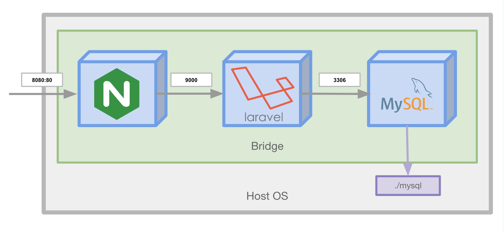

プロジェクトでDockerを使用する際、まず使用するであろうdocker-composeを紹介します。

## 概要
docker-composeはローカルでDockerのオーケストレーションを行うためのツールです。  
DockerのビルドからNetworkやVolumeの管理をコードベースで定義して行ってくれます。

## nginxを立ち上げるサンプル
docker-composeはDockerの構成をyamlを定義し、そのyamlを元に起動します。  
例えばnginxを起動し、ホストの8080ポートへコンテナの80ポートをフォワードする設定は以下のyamlになります。
```yaml
version: '3.7'

services:
  nginx:
    image: nginx
    ports:
      - 8080:80
```

`docker run -p 8080:80 nginx` とほぼ同じ動きをします(異なる点としては、docker-composeでは専用のNetworkを作成・使用する点です)。  
単純なnginxの起動であれば素のdockerコマンドで問題ありませんが、ここにPHP, MySQL...と増えていくとその威力を発揮します。


## Laravelのサンプルを元に学ぶ

雰囲気を知るために上記のような3つのコンテナを協調させて動かしてみましょう。

### 1. Laravelをdocker-composeで起動する
```
$ git clone https://github.com/y-ohgi/introduction-docker.git
$ cd introduction-docker/handson/laravel
$ docker-compose up
```

Play with Docker上へポートが公開されるので、ブラウザで確認してみましょう。

### 2. docker-compose.yamlを読む
起動したLaravelリポジトリのDockerfileをもとに、docker-compose.yamlの書き方を学びましょう。  

```yaml
version: '3.7'

services:
  nginx:
    build:
      context: .
      dockerfile: docker/nginx/Dockerfile
    volumes:
      - ./public:/var/www/html/public:ro
    ports:
      - 8080:80
    environment:
      PHP_HOST: app

  app:
    build:
      context: .
      dockerfile: Dockerfile
    env_file:
      - .env.example
    # volumes:
    #   - .:/var/www/html:cached

  mysql:
    image: mysql:5.7
    volumes:
      - ./mysql:/var/lib/mysql:delegated
    command: mysqld --character-set-server=utf8mb4 --collation-server=utf8mb4_general_ci
    environment:
      MYSQL_ALLOW_EMPTY_PASSWORD: 'yes'
    ports:
      - 13306:3306
```

### version
docker-composeのバージョンを指定します。  
特にこだわりがなければ最新のものを記述するようにしましょう。
```yaml
version: '3.7'
```

### services
起動するコンテナの定義を行います。  
このdocker-compose.yamlでは `nginx` , `app` , `mysql` の3つが定義されています。  

```yaml
services:
  nginx:
```


##### image
コンテナを起動するDocker Image を指定します。
```yaml
image: mysql:5.7
```

#### build
docker buildの実行情報を記述します。  
ここで定義された情報を元にDockerをビルドし、そのビルドしたイメージ使用してコンテナを起動します。  
`image` もしくは `build` どちらかを記述する必要があります。

コマンドの場合、 `docker build -f docker/nginx/Dockerfile .` と同一です。

```yaml
build:
  context: .
  dockerfile: docker/nginx/Dockerfile
```

#### volumes
ボリュームのマウントを行います。
コマンドの場合、 `-v $(pwd)/public:/var/www/html/public:ro <IMAGE ID>` オプションと同一です。
```yaml
volumes:
  - ./public:/var/www/html/public:ro
```

#### ports
ポートの開放を行います。  
左にホストのポートを、右にコンテナのポートを指定します。  
コマンドの場合、 `-p 8080:80` オプションと同一です。
```yaml
ports:
  - 8080:80
```

#### environment
起動するコンテナへ環境変数を定義します。  
コマンドの場合、 `-e PHP_HOST=app` オプションと同一です。
```yaml
environment:
  PHP_HOST: app
```

#### env_file
ファイルに定義された環境変数を読み取り、コンテナへ定義します。
```yaml
env_file:
  - .env.example
```

#### command
Dockerfileで定義されている `CMD` の上書きを行います。
```yaml
command: mysqld --character-set-server=utf8mb4 --collation-server=utf8mb4_general_ci
```

## docker-composeのコマンド
### up
カレントディレクトリに存在する `docker-compose.yaml` を参照してdocker-composeの起動
```
$ docker-compose up
```
終了させるには `Ctrl` + `c` 

### down
カレントディレクトリの `docker-compose.yaml` に紐付いているContainerとNetworkを削除
```
$ docker-compose down
```

Imageも削除
```
$ docker-compose down --rmi all
```

### rm
Volumeを削除
```
$ docker-compose rm
```


!!! note "Dockerで立ち上げたMySQLを使用する"
    Docker/docker-composeで立ち上げたMySQLコンテナにアクセスすることはもちろん可能です。  
    ここではCLIでの接続の仕方を2種類紹介します。
    
    **パターン1 . 立ち上げたMySQLコンテナを利用して接続する**

    ```
    $ docker-compose up -d
    ```

    ```
    $ docker-compose exec mysql mysql
    ```
    
    **パターン2 . ホストPCからMySQLコンテナへアクセスする。**

    ```
    $ apk add --no-cache mysql-client
    ```

    ```
    $ mysql -h 127.0.0.1 -P 13306 
    ```

    ここで改めてDockerネットワークを振り返ってみると面白いかも知れません。
