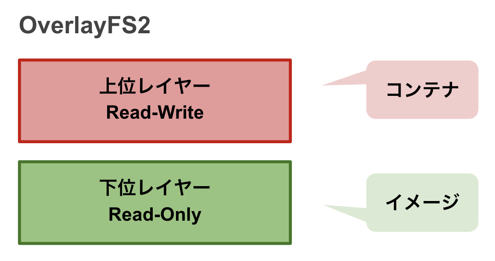

DockerイメージはDockerfileによって作成されるスナップショットでした。  
コンテナはDockerイメージを元に起動が行うことが可能です。

この章ではそのイメージとコンテナについて仕組みについて学んで頂き、より良い設計の一助になれば幸いです


## 「1コンテナ = 1プロセス」
コンテナは1つのプロセスを実行するための技術です。  

基本的にイメージを実行すると1つのコンテナが1プロセスを実行します。  
他のプロセス同様、複数のプロセスを1つのプロセスで同時に起動することは推奨されていません。  

イメージを実行すると1つのコンテナ(1つのプロセス)が作成され、責務が完了するとコンテナは終了されます。  
コンテナは廃棄容易を重視しており、需要に応じて簡単に増やせ、廃棄することが可能です。  
これによりイミュータブルインフラストラクチャを実現し、自然と特定の環境に依存しないインフラストラクチャが実現可能になります。

しかし、もし、複数のプロセスを動かすことになってしまった場合はイメージを分ける目安でしょう。  
ただ、リアルワールドでは全てのケースで一概に「1コンテナ = 1プロセス」で完結しないことがあります。  
その場合は「1つのコンテナにつき1つの責務」を目安にすることがが良いでしょう。  

!!! note "The Twelve-Factor App"
    Heroku社が提唱するモダンなサービスを実現するための12の方法論です。  
    コンテナの設計に迷ってしまった場合、まずはThe Twelve-Factor Appを参考に設計開発を行うことがオススメです。

    [The Twelve-Factor App （日本語訳）](https://12factor.net/ja/)

## ファイルシステム
イメージはRead-Onlyで、その上にRead-Write可能なコンテナレイヤーが立ち上がるのがイメージとコンテナの仕組みです。  
コンテナ上でなんらかの変更が発生した場合、コンテナレイヤーにのみ変更が行われイメージに変更は反映されません。



Dockerの現行のファイルシステムはOverlayFS2が採用されています。  
過去のファイルシステムでは複数の中間レイヤーから生成されるイメージの上にコンテナが立ち上がる形でした。  

現行のファイルシステムではコンテナ起動時に上位レイヤー（コンテナ）と下位レイヤー（イメージ）の2つになり、中間レイヤーを意識する必要がなくなりました。  
しかし、開発時には中間レイヤーをキャッシュとして持ってくれるため、中間レイヤーを意識することには変わりません。

!!! note "過去のファイルシステム"
    Dockerは過去Unison FileSystem(とAUFS)というファイルシステムが使用されていました。  
    このファイルシステムではOverlayFS2とは異なり、中間レイヤーを強く意識する必要がありました。

    ### Container
    Read-Onlyイメージの上に、Read-Writeを行うコンテナレイヤーが生成されることは変わりません。  
    

    ### Image
    しかし、 `RUN` や `COPY` などで中間レイヤーを増やすたびに、このファイルシステムの仕様上コンテナから **中間レイヤー1つずつにアクセスが走り** 、オーバーヘッドが発生してしまうことが問題でした。  
    

    現行のファイルシステムであるOverlayFS2では実行時に上位レイヤー（コンテナ）と、下位レイヤー（イメージ）の2つに分けられ、下位レイヤーは中間レイヤーを意識する必要がなくなりました。

## 中間レイヤーでキャッシュを行う
Dockerではビルドの高速化を行うため、中間レイヤーに変更が無ければ古い中間レイヤーをキャッシュとして使用することが可能です。  

開発中にライブラリは頻繁に追加しませんが、コードは頻繁に変更します。  
以下のDockerfileの例だと毎回ライブラリをインストールを行なってしまい、ビルド時に生成される中間レイヤーを有効活用できません。
```Dockerfile
FROM python:3.12-slim

WORKDIR /app

# 全てのファイルを取り込むため、コードが変更されるたびに中間レイヤーが再生成される
COPY . .

# 最初からライブラリをインストールし直す
RUN pip install -r requirements.txt

EXPOSE 8888

CMD ["python", "main.py"]

```

ライブラリの変更があった場合のみ、ライブラリのインストールをし直すことでビルドタイムを短縮可能になります。
```Dockerfile
FROM python:3.12-slim

WORKDIR /app

# requirements.txt の変更があった場合、中間レイヤーが再生成される
COPY requirements.txt .

# requirements.txtの変更がなかった場合、前回のビルド時の中間レイヤーのキャッシュが使用されるため以下の行はスキップされる
RUN pip install -r requirements.txt

# 全てのファイルを取り込む
COPY . .

EXPOSE 8888

CMD ["python", "main.py"]
```

## ステートレスなコンテナにする
結論から、データソースはクラウドプロバイダーを使用する場合はマネージドなデータソースを使用しましょう（S3, RDS, etc）。

基本的にコンテナ技術は廃棄容易性に優れた技術である反面、廃棄と相反する「データの永続化」を苦手としています。  
最初にも記載した通り、ステートは外部のデータの永続化を得意とするサービスに任せましょう。  
コンテナはステートレスであることで廃棄容易性が担保され、スケールイン/スケールアウトを得意とするため負荷分散が容易となります。  
なにか不具合が起きた場合やOOMが発生してしまっている場合、素早くそのコンテナを捨て、次のコンテナを立て直すことができることも大きなメリットです。もちろんこういったことにならないようデバッグやチューニングは重要ですが、素早い対応が可能なことでサービスの信頼性に繋がります。  

また、ステートをもたないことで特定の環境に依存せず、高い可搬性があります。  
ローカルで動くコンテナは本番で動かすことが往々にして可能になります。

## ログは標準出力に出す
IaaSなどではログをファイルにため、fluentdなどで転送していました。  
しかし、コンテナではファイルに書き込むことでステートを持ってしまうことに繋がります。  
基本的に構造化された1行のログ（例えばJSON）を標準出力に出力し収集しましょう。  

また、Dockerは標準出力しかなく、標準エラーは標準出力と統合されて出力される点にも注意してください。

## まとめ
* イメージは「1コンテナ = 1プロセス」の責務になるよう設計します。
* イメージはRead-Onlyで、その上にRead-Writeを行うためのコンテナ（レイヤー）が立ち上がります。
* 実行時に中間レイヤーのオーバーヘッドを意識する必要は無くなったが、キャッシュとして意識する必要は変わりません。
