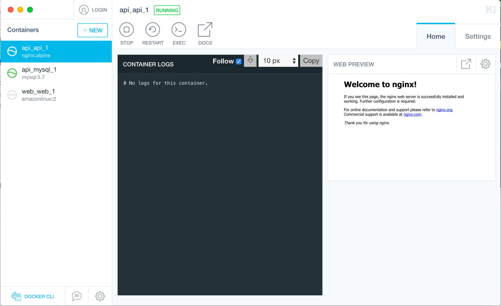

dockerを使用する際に便利なツール

## Kitematic


KitematicというdockerをGUIベースで扱うためのツールです。  
ローカルのDockerの管理はもちろんDockerHubの検索など、非常に高機能で見やすいのでGUIで扱いたい人には良いとおもいます。  
私はCLIでしか使わないのでGUIは知らないです。

### Install
mac
```
$ brew cask install kitematic
```

windows  
[Install Docker Toolbox on Windows | Docker Documentation](https://docs.docker.com/toolbox/toolbox_install_windows/)

---
## `docker-clean`
Dockerリソースを削除するためのコマンド。  
Dockerは基本的にエフェメラルであるべきなので脳死で定期的に打っていくといいとおもいます。とてもすき。べんり。  

### Example
全てのcontainerを停止、削除します。関連するvolumeとnetworksも削除します。
```
$ docker-clean stop
```

Dockerのリソース全てを削除する。  
起動中のcontainerも削除される点に注意。  
```
$ docker-clean all
```

### Install
mac  
```
$ brew install docker-clean
```

windows  
[ZZROTDesign/docker-clean: A script that cleans docker containers, images, volumes, and networks.](https://github.com/ZZROTDesign/docker-clean)

---
## dlayer
Docker imageのレイヤーの詳細を確認するためのコマンドです。  
どのプロセス/ファイルが容量を確保してるのか見れるので、imageの軽量化を試みる際に非常に有用です。

```
$ docker save mylaravel | dlayer -n 5
  : 
====================================================================================================
 746 kB          $ #(nop) COPY dir:aa72315e7d707232431f623429d839c619de8d4dfe8ec38f8da936af37d9f359 in .
====================================================================================================
 337 kB          var/www/html/public/js/app.js
 159 kB          var/www/html/composer.lock
 128 kB          var/www/html/public/css/app.css
  13 kB          var/www/html/bootstrap/cache/services.php
 9.2 kB          var/www/html/config/app.php

====================================================================================================
  25 MB          $ set -x && composer install --no-progress --no-dev && addgroup ${GNAME} -g ${GID} && adduser -D -G ${GNAME} -u ${UID} ${UNAME} && chown -R ${UNAME}:${GNAME} ${WORKDIR} && mv /root/.composer /home/${UNAME}/ && chown -R ${UNAME}:${GNAME} /home/${UNAME}
====================================================================================================
 3.3 MB          var/www/html/vendor/laravel/framework/src/Illuminate
 1.9 MB          var/www/html/vendor/nesbot/carbon/src/Carbon
 1.5 MB          var/www/html/vendor/symfony/polyfill-iconv/Resources/charset
 1.1 MB          home/www/.composer/cache/files/laravel/framework/9bfc7b5a4daf5af99f1c03b2fe4278aadc50b123.zip
 743 kB          var/www/html/vendor/nikic/php-parser/lib/PhpParser
```
